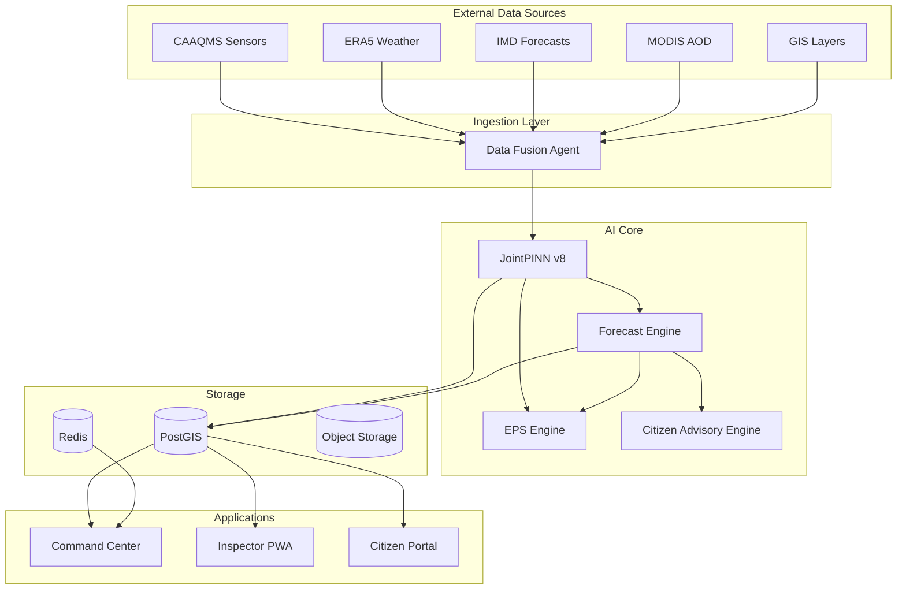
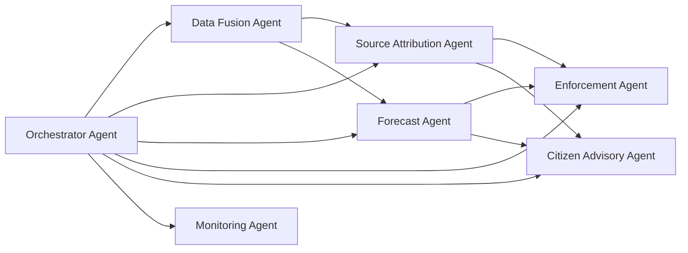
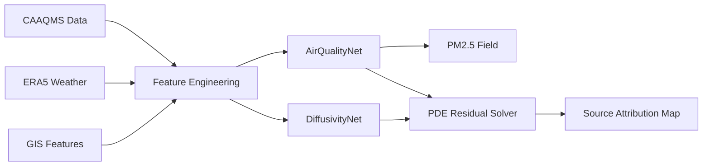
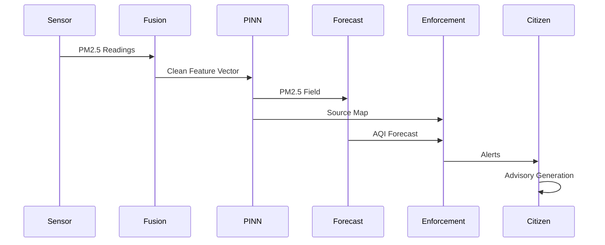
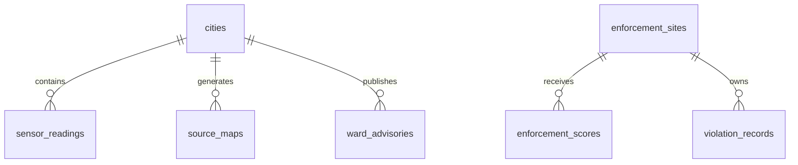

<p align="center">
  
<div align="center">

# VayuMind

### AI-Powered Urban Air Quality Intelligence Platform

<br>


</div>

</p>

<p align="center">
  <b>Physics-Informed Source Attribution • Hyperlocal Forecasting • Enforcement Intelligence</b>
</p>

---

# Overview

VayuMind is an AI-powered municipal operating system for air quality intervention.

Unlike traditional AQI dashboards that only visualize pollution levels, VayuMind uses Physics-Informed Neural Networks (PINNs) to reconstruct atmospheric pollution fields, identify emission hotspots, forecast future AQI, prioritize enforcement actions, and generate multilingual citizen advisories.

### Core Question

Most systems answer:

> How polluted is the air?

VayuMind answers:

> Where is the pollution coming from, what will happen next, and what action should be taken right now?

---

# The Problem

India loses over **1.67 million lives annually** due to air pollution.

Despite:

- 900+ CAAQMS monitoring stations
- National Clean Air Programme (NCAP)
- State Pollution Control Boards
- Smart City Initiatives

Cities still lack:

- Source Attribution
- Hyperlocal Forecasting
- Enforcement Intelligence
- Intervention Planning
- Citizen Response Automation

Current systems provide measurements.

VayuMind provides intelligence.

---

# Key Innovation

## Physics-Informed Source Attribution

Instead of treating pollution forecasting as a black-box machine learning problem, VayuMind solves the atmospheric transport equation:

```math
\frac{\partial C}{\partial t}
+
u \cdot \nabla C
=
\nabla \cdot (K \nabla C)
+
S(x,y,t)
```

Where:

| Symbol | Meaning |
|----------|------------|
| C | PM2.5 Concentration |
| u | Wind Velocity |
| K | Turbulent Diffusivity |
| S | Emission Source Term |

The source term becomes a real-time pollution hotspot map.

---

# Product Modules

| Module | Capability |
|----------|------------|
| PINN Intelligence Layer | Real-time source attribution |
| Forecast Layer | 24–72 hour AQI forecasting |
| Enforcement Intelligence | Inspection prioritization |
| Citizen Intelligence | Multilingual health advisories |
| City Command Center | Unified municipal dashboard |

---

# System Architecture



---

# Multi-Agent Architecture



---

# PINN Inference Pipeline



---

# City Intelligence Workflow



---

# Tech Stack

## Frontend

<p align="left">

</p>

- Next.js 15
- TypeScript
- Tailwind CSS
- Leaflet
- MapLibre
- Recharts

---

## Backend

<p align="left">

</p>

- FastAPI
- Celery
- Redis
- PostgreSQL
- PostGIS
- TimescaleDB

---

## AI / ML

<p align="left">

</p>

- PyTorch
- JointPINN v8
- Gemini
- NumPy
- Physics-Informed Neural Networks

---

## DevOps & Monitoring

<p align="left">

</p>

- Docker Compose
- Prometheus
- Grafana
- OpenTelemetry

---

# Architecture Components

## PINN Intelligence Layer

### Responsibilities

- PM2.5 Field Reconstruction
- Source Attribution
- Diffusivity Estimation
- Uncertainty Quantification

### Performance

| Metric | Value |
|----------|--------|
| Rolling R² | 0.8902 |
| Holdout R² | 0.9049 |
| PDE Compliance | 100% |
| Forward Pass | 0.46 ms |
| Source Attribution | 3.38 ms |

---

## Forecast Layer

### Capabilities

- 24h Forecast
- 48h Forecast
- 72h Forecast
- Extreme Event Detection
- AQI Deterioration Alerts

### Outputs

- Forecast Grid
- AQI Categories
- Uncertainty Bands
- Extreme Event Warnings

---

## Enforcement Intelligence

### Enforcement Priority Score (EPS)

```text
EPS =
0.30 × Source Intensity
+ 0.25 × Forecast Deterioration
+ 0.20 × Population Exposure
+ 0.15 × Violation History
+ 0.10 × Sensitive Receptors
```

### Outputs

- Ranked Enforcement Queue
- Mobile Inspection Brief
- Impact Estimation
- Enforcement ROI

---

## Citizen Intelligence

### Features

- 12 Indian Languages
- WhatsApp Advisories
- School Safety Protocols
- Outdoor Worker Alerts
- Vulnerability Mapping

### Supported Languages

- English
- Hindi
- Marathi
- Tamil
- Telugu
- Bengali
- Gujarati
- Kannada
- Malayalam
- Punjabi
- Assamese
- Odia

---

# Project Structure

```bash
VayuMind

├── frontend
│   ├── app
│   ├── components
│   ├── hooks
│   └── lib
│
├── services
│   ├── api_gateway
│   ├── pinn_serving
│   ├── forecast_service
│   ├── enforcement_service
│   ├── advisory_service
│   └── agents
│
├── infrastructure
│   ├── docker
│   ├── monitoring
│   └── scripts
│
├── models
│   ├── pinn_delhi_final.pth
│   └── scaler_stats.json
│
├── docs
│
└── docker-compose.yml
```

---

# Database Architecture



---

# API Overview

## PINN Service

```http
POST /api/v1/pinn/predict
POST /api/v1/pinn/source_attribution
GET  /api/v1/pinn/field/{timestamp}
GET  /api/v1/pinn/health
```

## Forecast Service

```http
GET  /api/v1/forecast/{city}/{horizon}
POST /api/v1/forecast/ward
```

## Enforcement Service

```http
GET  /api/v1/enforcement/queue
GET  /api/v1/enforcement/brief
POST /api/v1/enforcement/outcome
```

## Citizen Service

```http
GET  /api/v1/citizen/advisory
GET  /api/v1/citizen/vulnerability
POST /api/v1/citizen/school/check
```

---

# Performance Benchmarks

| Benchmark | Value |
|------------|---------|
| Rolling R² | 0.8902 |
| Holdout R² | 0.9049 |
| PDE Compliance | 100% |
| Source Consistency | 0.9960 |
| Inference Latency | 0.46 ms |
| Attribution Latency | 3.38 ms |
| LOSO Spatial R² | 0.8327 |

---

# Deployment

## Clone Repository

```bash
git clone https://github.com/your-org/vayumind.git

cd vayumind
```

## Configure Environment

```bash
cp .env.example .env
```

## Start Platform

```bash
docker compose up --build
```

---

# Running Services

| Service | Port |
|----------|--------|
| Frontend | 3000 |
| API Gateway | 8000 |
| PINN Service | 8001 |
| Advisory Service | 8002 |
| Forecast Service | 8003 |
| PostgreSQL | 5432 |
| Redis | 6379 |
| Grafana | 3001 |
| Prometheus | 9090 |

---

# Roadmap

### Phase 1

- Delhi Deployment
- Enforcement Validation
- School Alert System

### Phase 2

- Mumbai Expansion
- WRF 1km Weather Integration
- Multi-City Dashboard

### Phase 3

- RA-BPINN
- Dynamic Sensor Placement
- Cross-City Pollution Transport

---

# Impact

Traditional AQI systems:

```text
Measure → Report
```

VayuMind:

```text
Measure
   ↓
Attribute
   ↓
Forecast
   ↓
Enforce
   ↓
Intervene
   ↓
Learn
```

---

# ET AI Hackathon 2026

**Problem Statement 5 — AI-Powered Urban Air Quality Intelligence**

> The atmosphere has always obeyed its own equations.
>
> **VayuMind is the first system that listens.**
